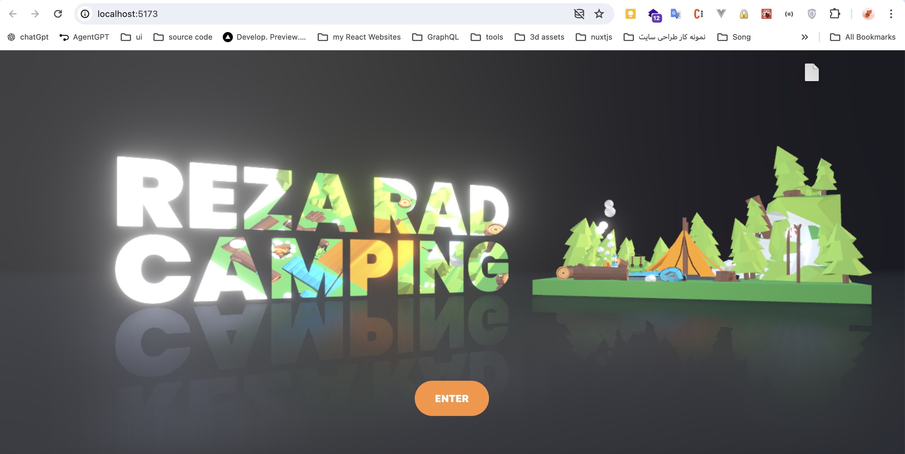

# 3D WebSite - 3D Text effect with React Three Fiber

This project is a 3D WebSite built using `React` and `Three.js`. It utilizes various technologies and libraries to create a seamless and interactive user experience.


## Technologies Used

- **React Three Fiber:** react-three-fiber is a React renderer for threejs. Build your scene declaratively with re-usable, self-contained components that react to state, are readily interactive and can participate in React's ecosystem.g.

## Getting Started

1. Clone the repository:

   ```bash
   git clone https://github.com/rezaansarirad/3D-website.git
   ```

2. Install dependencies:

   ```bash
   yarn install
   ```

3. Run the project:

   ```bash
   yarn start
   ```

## Screenshots



<!-- Add more screenshots if needed -->

## Contributing

Camping Asset Collection by Alex Safayan CC-BY via Poly Pizza

Hope you enjoy.
